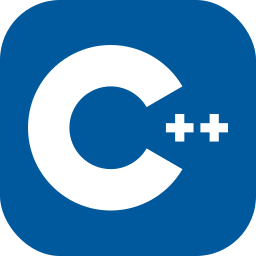

  
    
  

    
  

  
  <h1>
    &ltHello, World!&gt I`m Chirantan!
    
  </h1>

---

###  Few things About Me :
I am a Frontend Developer and ML enthusiast  from India.

- 📘 I'm a Second year student at Vellore Institute of Technology(VIT), Vellore.

- 🌱 Exploring Machine Learning.

- 🎧 In my free time, I <s> code the whole day </s> &nbsp; listen to music and play games.

- 📖 Have some novel suggestions? Ping me up!
  

---

### :hammer_and_wrench: Learning and working with :

  &nbsp;
  &nbsp;
  &nbsp;
  &nbsp;
  &nbsp;
  &nbsp;
  &nbsp;
  &nbsp;
  &nbsp;
  &nbsp;
  &nbsp;
  &nbsp;
  &nbsp;
  &nbsp;
  

---

### :fire: My Stats :

<h3 align="center"><i>Love to Connect with people so feel free to text me on any of the following! </i></h3>

  
  
  

<h4 align="center"><i> Until then, Adios! </i><h4> 
